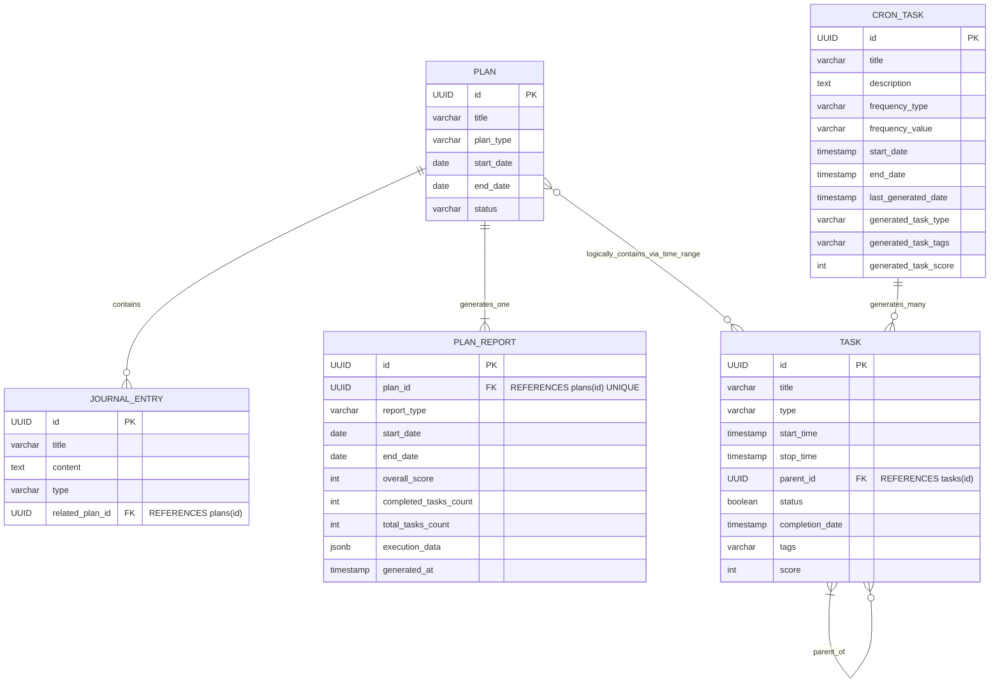

# 计划安排 Web 应用设计文档

## 1. 引言

本文档详细阐述一个自上而下（年、季、月、周、日）多层级计划安排 Web 应用的设计方案。该应用旨在帮助用户有效管理多层级计划与任务，追踪执行情况，并提供数据可视化洞察，从而提升规划和反思能力。

---

## 2. 核心功能概述

- **多层级计划与任务管理**  
  支持年、季、月、周、日的计划层级，以及任务间无限级父子分解关系。
- **任务链路追踪**  
  底层任务视图中清晰展示其所属完整任务分解链路，底层任务完成时自动/手动向上级任务传递完成状态。
- **周期任务自动化**  
  定义重复性任务规则，系统自动生成每日任务。
- **计划执行可视化**  
  提供计划完成度、任务分数、趋势图、热力图等数据展示。
- **计划与任务反思**  
  允许用户针对不同层级的计划记录思考、感悟和总结。

---

- task 任务
  - 最小单元，它代表了一条todo，有起始，结束时间，类型（年，季，月，周，日）
- plan 计划
  - 一个聚合标志，标志了时间范围，类型
- JournalEntry 日志
  - 代表一个plan的开始与结束的总结内容，多个日志可以绑定一个plan

## 3. 系统核心模型设计

### 3.1. Plan（计划）

- **职责**：时间范围的容器和组织者，承载特定时间粒度下的整体规划意图，不直接代表可执行任务。
- **主要属性**：
  - `id` (UUID)：唯一标识符
  - `title` (字符串)：计划标题
  - `plan_type` (枚举)：年、季、月、周、日
  - `start_date` / `end_date` (日期)：起止日期（左闭右开）
  - `status` (字符串)：未开始/进行中/已完成/已过期
  - `created_at` / `updated_at` (时间戳)
- **关系**：
  - 一个 Plan 可关联多个 `JournalEntry`
  - 一个 Plan 可生成一个 `PlanReport`
  - `Task` 通过其 `start_time`、`stop_time` 被逻辑归属于某个 Plan

---

### 3.2. Task（任务）

- **职责**：可执行行动单元，支持多层级父子关系，完成状态可递归向上传递。
- **主要属性**：
  - `id` (UUID)
  - `title` (字符串)
  - `description` (文本，可选)
  - `type` (枚举)：年/季/月/周/日
  - `start_time` / `stop_time` (时间戳)
  - `parent_id` (UUID，可空)：父任务 id
  - `status` (布尔)：是否完成
  - `completion_date` (时间戳，可空)
  - `tags` (字符串)
  - `score` (整数 1-10)
  - `created_at` / `updated_at` (时间戳)
- **核心逻辑**：
  - 任务完成时，递归检查父任务所有子任务是否完成，若全部完成则自动/提示递归完成父任务

---

### 3.3. JournalEntry（日志条目）

- **职责**：记录用户对特定 Plan 的思考、感悟、总结或目标设定。
- **主要属性**：
  - `id` (UUID)
  - `title` (字符串)
  - `content` (文本)
  - `type` (枚举)：年/季/月/周/日
  - `related_plan_id` (UUID)
  - `created_at` / `updated_at` (时间戳)

---

### 3.4. CronTask（周期任务）

- **职责**：自动化任务生成器蓝图，定义重复性任务生成规则。
- **主要属性**：
  - `id` (UUID)
  - `title` (字符串)
  - `description` (文本)
  - `frequency_type` (字符串)：如 daily、weekly、monthly、cron_expression、workdays
  - `frequency_value` (字符串)：如 "wednesday,friday" 或 Cron 表达式
  - `start_date` / `end_date` (时间戳)
  - `last_generated_date` (时间戳，可空)
  - `generated_task_type` (枚举)
  - `generated_task_tags` (字符串)
  - `generated_task_score` (整数)
  - `created_at` / `updated_at` (时间戳)
- **生成逻辑**：
  - 后台调度服务定期扫描 CronTask，按规则生成新的 Task，并更新 last_generated_date

---

### 3.5. PlanReport（计划报告）

- **职责**：持久化存储 Plan 周期内关键执行指标和数据汇总，加速前端仪表盘渲染。
- **主要属性**：
  - `id` (UUID)
  - `plan_id` (UUID)
  - `report_type` (枚举)
  - `start_date` / `end_date` (日期)
  - `overall_score` (整数)
  - `completed_tasks_count` / `total_tasks_count` (整数)
  - `execution_data` (JSONB)：用于前端图表的详细聚合数据
  - `generated_at` / `created_at` / `updated_at` (时间戳)
- **生成逻辑**：
  - 后台服务定时或 Plan 周期结束后自动计算生成

---

## 4. 视图层概念：PlanDashboard（计划仪表盘）

- **职责**：纯前端交互可视化界面，通过调用后端 API 获取数据并渲染，负责用户交互。
- **主要功能**：
  - **分层展示**
    - 日仪表盘：展示当天 Plan、底层 Task 及任务链路、JournalEntry
    - 周/月/季/年仪表盘：展示对应层级的 Plan、JournalEntry，聚合下层 PlanReport 数据
  - **数据可视化**：折线图、热力图、饼图等
  - **用户交互**：切换时间范围、选择粒度、新建计划/任务/日志
  - **未来计划展示**：无 Plan 时友好提示并提供创建入口

---

## 5. 模型关系概览（Mermaid 图示）

---

## 6. 核心逻辑流（示例）

### 6.1. 用户查看某日计划

1. 前端 PlanDashboard (日视图) 请求后端
2. 后端根据日期查询对应 DailyPlan 实体
3. 查询该 DailyPlan 时间范围内所有底层 Task
4. 对每个 Task 递归 parent_id 链，构建完整任务链路
5. 查询关联 JournalEntry
6. 组装数据响应前端
7. 前端渲染 DailyPlanDashboard

### 6.2. 用户完成一个底层 Task

1. 用户在 PlanDashboard 标记 Task 为完成
2. 前端请求后端更新 Task 状态
3. 后端设置 Task status=true, completion_date
4. 递归检查父任务所有子任务是否都完成，若是则递归向上完成父任务
5. 异步触发 PlanReport 更新

---

## 7. 后续考量

- **认证与授权**：用户身份与数据访问权限管理
- **通知系统**：任务截止及周期任务生成提醒
- **数据导入/导出**：支持数据备份与迁移
- **前端技术选型**：React/Vue/Angular 等
- **后端技术栈**：Go 语言及其 Web 框架、ORM、消息队列
- **错误处理与日志**：健壮的异常处理和日志记录机制

---

## 动线

### 首页
#### 新建任务
用户进入首页，看到的是今天的计划。然后发现还是一片空白，因为今天还没做计划
于是点击新建任务。
- 从已有计划拆分
- 新建今日计划

选择了已有任务拆分
- 读12本书
  - 读3本书 Q1
    - 读 《怎么办》3月
      - 读 《怎么办》 第三节 （本周）
-  。。。 其他计划
-  

选择一个已经有的周任务，新建tsk
- 读 xxx 标签：读书 （这个是从上层继承下来的）

####  总结

一天结束了，用户做今日总结。在界面的底下，有新建，编辑，删除日志
目前已经有一个日志，是今天开始的时候写的。
新建，今日总结 xxxxx
同时在完成各个任务的时候，可以标记分数： 是否尽力完成了本任务 1-10分

#### 在时间段计划处查看
比如在月计划处，我可以查看本月计划情况

同时还有一个折线图
本月 任务分数图     -按周/按天- 

选择按周

590分（共60个任务）    300分（共41个任务）  0/0

第一周                  第二周              第三周 

任务数量与分数，是每一天的天任务