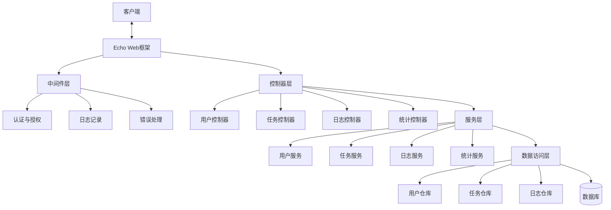

# new
## 前言

真理确实越辩越明，我现在对于整体的设计已经很清楚了


## 1. 项目概述

本文档描述了一个基于Go语言和Echo框架的年度计划管理系统后端设计。该系统允许用户创建、管理和跟踪不同时间粒度（年、季度、月、周、日）的任务，记录相关日志，并提供统计分析功能。

### 核心功能
- 用户认证与授权
- 多层级任务管理（年→季→月→周→日）
- 上下文视图和全局树视图
- 日志记录与关联
- 计划完成情况统计分析

## 2. 系统架构



### 2.1 技术选型
- **ORM**: 使用 [Ent](https://entgo.io/) 作为ORM框架，以其代码生成和类型安全的特性来操作数据库。
- **UUID**: 使用 `google/uuid` 包来生成和管理UUID。
- **配置**: 使用 `ini` 文件进行配置，并支持环境变量覆盖。
- **枚举类型**: 
    - `Task` 的 `Type` 和 `Status` 字段。
    - `JournalEntry` 的 `TimeScale` 和 `EntryType` 字段。
    - 在Go代码中应使用自定义类型和常量（如 `iota`）来实现枚举，以增强类型安全和代码可读性。

## 3. 数据模型设计

### 核心数据模型（全部使用UUID作为主键）

#### User (用户)
- ID: uuid
- Username: string
- Password: string
- Email: string
- CreatedAt: time.Time
- UpdatedAt: time.Time

#### Task (任务)
- ID: uuid
- Title: string
- Description: string
- Type: string (年/季/月/周/日) -> **实现为Go枚举**
- StartDate: time.Time
- EndDate: time.Time
- Status: string (pending/in-progress/completed) -> **实现为Go枚举**
- Score: int (1-10分)
- ParentID: *uuid
- UserID: uuid
- Tags: string
- CreatedAt: time.Time
- UpdatedAt: time.Time

#### JournalEntry (日志)
- ID: uuid
- Content: string
- TimeReference: string (如"2025年7月"或"2025年W28周")
- TimeScale: string (日/周/月/季/年) -> **实现为Go枚举**
- EntryType: string (开始计划/结束总结/阶段反思) -> **实现为Go枚举**
- UserID: uuid
- CreatedAt: time.Time
- UpdatedAt: time.Time

#### JournalTaskRelation (日志-任务关联)
- ID: uuid
- JournalEntryID: uuid
- TaskID: uuid

### 请求/响应结构体建议

#### TaskRequest
- Title: string
- Description: string
- Type: string
- StartDate: time.Time
- EndDate: time.Time
- Status: string
- ParentID: *uuid
- Tags: string

#### JournalEntryRequest
- Content: string
- TimeReference: string
- TimeScale: string
- EntryType: string
- RelatedTaskIDs: []uuid

#### PaginationResponse
- Total: int64
- CurrentPage: int
- PageSize: int
- Data: interface{}

#### ErrorResponse
- Error: string
- Message: string

## 4. 数据库设计

### users

| 字段 | 类型 | 约束 |
|------|------|------|
| id | UUID | PRIMARY KEY |
| username | VARCHAR(50) | UNIQUE, NOT NULL |
| password | VARCHAR(100) | NOT NULL |
| email | VARCHAR(100) | UNIQUE |
| created_at | TIMESTAMP | DEFAULT CURRENT_TIMESTAMP |
| updated_at | TIMESTAMP | DEFAULT CURRENT_TIMESTAMP |

### tasks

| 字段 | 类型 | 约束 |
|------|------|------|
| id | UUID | PRIMARY KEY |
| title | VARCHAR(255) | NOT NULL |
| description | TEXT |  |
| type | VARCHAR(20) | NOT NULL |
| start_date | TIMESTAMP | NOT NULL |
| end_date | TIMESTAMP | NOT NULL |
| status | VARCHAR(20) | DEFAULT 'pending' |
| score | INT | DEFAULT 0 |
| parent_id | UUID |  |
| user_id | UUID | NOT NULL, FOREIGN KEY users(id) |
| tags | VARCHAR(255) |  |
| created_at | TIMESTAMP | DEFAULT CURRENT_TIMESTAMP |
| updated_at | TIMESTAMP | DEFAULT CURRENT_TIMESTAMP |

### journal_entries

| 字段 | 类型 | 约束 |
|------|------|------|
| id | UUID | PRIMARY KEY |
| content | TEXT | NOT NULL |
| time_reference | VARCHAR(50) | NOT NULL |
| time_scale | VARCHAR(20) | NOT NULL |
| entry_type | VARCHAR(20) | NOT NULL |
| user_id | UUID | NOT NULL, FOREIGN KEY users(id) |
| created_at | TIMESTAMP | DEFAULT CURRENT_TIMESTAMP |
| updated_at | TIMESTAMP | DEFAULT CURRENT_TIMESTAMP |

### journal_task_relations

| 字段 | 类型 | 约束 |
|------|------|------|
| id | UUID | PRIMARY KEY |
| journal_entry_id | UUID | NOT NULL, FOREIGN KEY journal_entries(id) |
| task_id | UUID | NOT NULL, FOREIGN KEY tasks(id) |
| UNIQUE | (journal_entry_id, task_id) |  |

### 推荐索引
- tasks: user_id, parent_id, type, start_date, end_date
- journal_entries: user_id, time_scale
- journal_task_relations: journal_entry_id, task_id

## 5. API 设计

### 认证相关

| 路径 | 方法 | 描述 |
|------|------|------|
| /api/auth/register | POST | 用户注册 |
| /api/auth/login | POST | 用户登录 |
| /api/auth/me | GET | 获取当前用户信息 |
| /api/auth/logout | POST | 用户登出 |

### 任务相关

| 路径 | 方法 | 描述 |
|------|------|------|
| /api/tasks | GET | 获取任务列表（分页、过滤） |
| /api/tasks/:id | GET | 获取单个任务详情 |
| /api/tasks | POST | 创建新任务 |
| /api/tasks/:id | PUT | 更新任务 |
| /api/tasks/:id | DELETE | 删除任务 |
| /api/tasks/:id/children | GET | 获取直接子任务 |
| /api/tasks/:id/full-tree | GET | 获取完整任务树 |
| /api/tasks/:id/sub-task | POST | 创建子任务 |
| /api/tasks/:id/score | PUT | 更新任务分数 |
| /api/tasks/context-view | GET | 获取上下文视图（同级+上级） |
| /api/tasks/global-view | GET | 获取全局树视图 |

### 日志相关

| 路径 | 方法 | 描述 |
|------|------|------|
| /api/journals | GET | 获取日志列表（分页、过滤） |
| /api/journals/:id | GET | 获取日志详情 |
| /api/journals | POST | 创建日志 |
| /api/journals/:id | PUT | 更新日志 |
| /api/journals/:id | DELETE | 删除日志 |
| /api/journals/by-time | GET | 按时间范围查询日志 |

### 统计相关

| 路径 | 方法 | 描述 |
|------|------|------|
| /api/stats/task-completion | GET | 获取任务完成统计 |
| /api/stats/score-trend | GET | 获取评分趋势 |
| /api/stats/time-distribution | GET | 获取任务时间分布 |

## 6. 服务层设计要点

### TaskService
- 创建任务、子任务（检查父任务合法性）
- 获取单任务、同级/上级任务、完整任务树
- 任务的增删改查、任务评分
- 上下文视图/全局视图的获取

### JournalService
- 创建/更新/删除日志
- 日志与任务关联
- 按时间/类型筛选日志

### StatsService
- 获取指定时间范围的任务完成度、评分趋势、任务分布等统计数据

## 7. 单元测试场景

### 用户相关
- 注册、登录、登出、获取当前用户信息
- 异常路径（重复用户名、密码错误等）

### 任务相关
- 创建/更新/删除/获取任务
- 创建子任务
- 获取直接子任务、完整任务树
- 获取上下文视图/全局视图
- 任务评分
- 任务分页与多条件过滤

### 日志相关
- 创建/更新/删除日志
- 日志与任务关联
- 按时间/类型筛选日志

### 统计相关
- 任务完成度统计
- 评分趋势统计
- 任务分布统计

### 集成场景
- 任务拆分、日志、评分、统计的全链路测试
- 并发测试、权限测试、错误处理测试

## 8. 配置管理

项目配置将通过 `config.ini` 文件进行管理。应用启动时会读取此文件。为了便于容器化部署，应优先从环境变量读取配置，若环境变量不存在，则回退到使用 `config.ini` 文件中的值。

### 配置文件示例 (`config.ini`)
```ini
[server]
host = 0.0.0.0
port = 8080

[log]
level = info

[database]
host = localhost
port = 5432
user = user
password = password
dbname = okr_db
```

### 配置项说明
- **[server]**: 应用服务器配置
    - `host`: 监听的主机地址
    - `port`: 监听的端口
- **[log]**: 日志配置
    - `level`: 日志级别 (e.g., `debug`, `info`, `warn`, `error`)
- **[database]**: 数据库连接配置
    - `host`: 数据库主机地址
    - `port`: 数据库端口
    - `user`: 数据库用户名
    - `password`: 数据库密码
    - `dbname`: 数据库名称

## 9. 部署与扩展建议

- 使用Docker容器化
- **环境变量配置**: 如“配置管理”一节所述，优先使用环境变量覆盖 `config.ini` 中的配置。
- 数据库迁移脚本
- 日志和监控
- 预留团队/协作、本地化、通知、API版本等扩展能力
